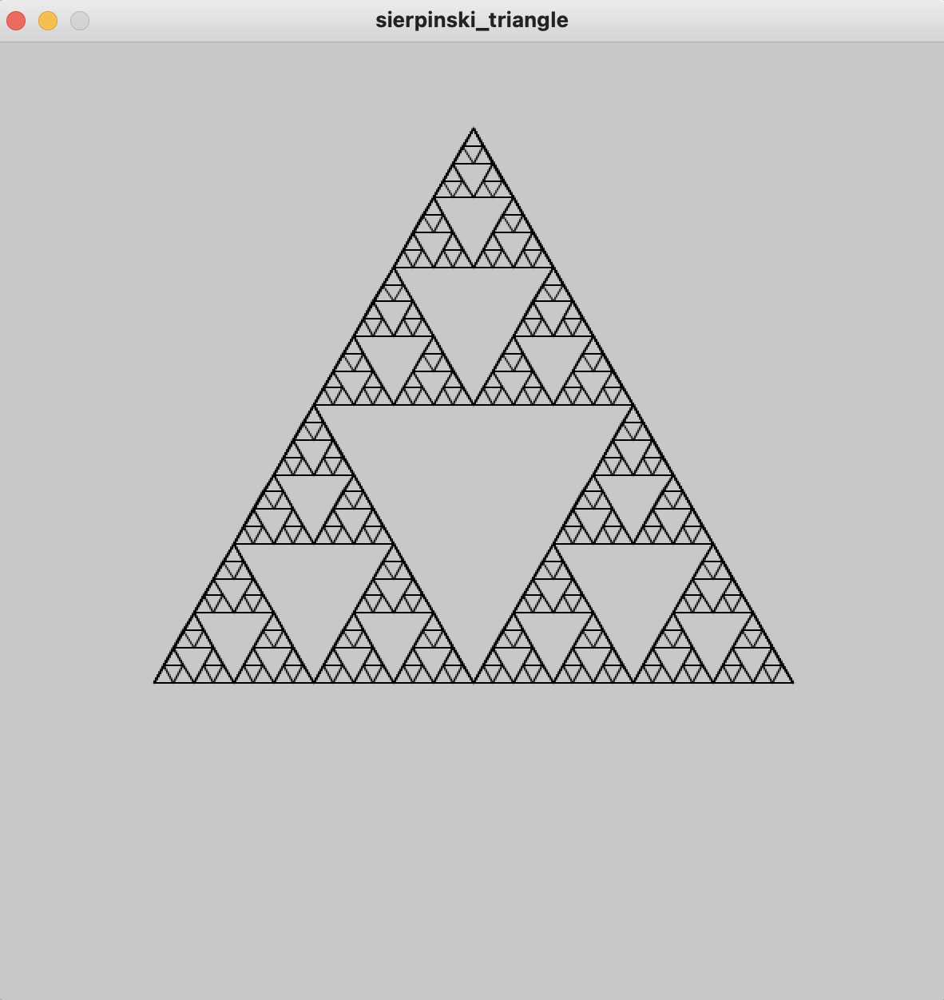

# Sierpinksis_Triangle

{:height="50%" width="50%"}

There is a class called sierpinksi, each object of sierpinksi keeps track of 

1: leftPoint, rightPoint, topPoint: the three PVectors that define the points of its triangle

2: generation: which indicates to the program what "generation" of the fractal we're in 

3: children: an array of length 3 for nested sierpinskis to be generated

```processing
class sierpinski{
  PVector leftPoint, rightPoint, topPoint;
  int generation;
  sierpinski[] children;
```
The sierpinksi constructor takes in 3 vectors and a generation. The global variable generationCap (the generation cap is currently hardcoded to be 6 but is easily changable)is what indicates to the program when to stop recursion, each sierpinski object will only generate children sierpinksi's if its generaiton is under to or equal the generation cap
```processing
sierpinski(PVector p1,PVector p2,PVector p3, int generation){
   this.leftPoint = p1.copy();
   this.rightPoint = p2.copy();
   this.topPoint = p3.copy();
   this.generation = generation;
   if(generation <= generationCap){
     this.generateChildSierpinskis();
   }
  }
```
The method generateChildSierpinskis() finds the 3 midpoints of the sierpinski relevant to creating new sierpinskis and then constructs three new sierpinskis which are stored in children
```processing
PVector leftMidpoint = findMidpoint(leftPoint, topPoint);
PVector bottomMidpoint  = findMidpoint(leftPoint, rightPoint);
PVector rightMidpoint = findMidpoint(rightPoint, topPoint);
children[0] = new sierpinski(leftPoint,bottomMidpoint,leftMidpoint, generation + 1);
children[1] = new sierpinski(bottomMidpoint,rightPoint, rightMidpoint, generation + 1);
children[2] = new sierpinski(leftMidpoint,rightMidpoint, topPoint, generation + 1);
```
Finally the show() method will call show() on the child sierpinski, once the generationCap sierpinksis are reached, lines are draw between the points
```processing
void show(){
    strokeWeight(1);
    if(generation == generationCap){
      line(leftPoint.x,leftPoint.y,rightPoint.x,rightPoint.y);
      line(rightPoint.x,rightPoint.y,topPoint.x,topPoint.y);
      line(topPoint.x,topPoint.y,leftPoint.x,leftPoint.y);
     }
    strokeWeight(3);
    if(generation <= generationCap){
      children[0].show();
      children[1].show();
      children[2].show();
    }
  }
```

